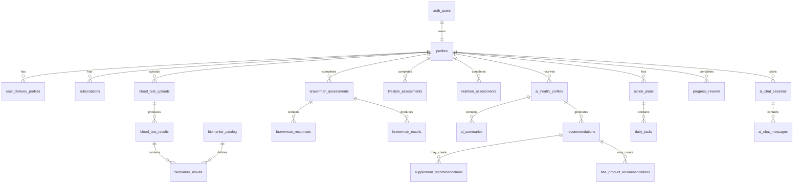

# DATABASE_SCHEMA.md

## Project

Health Coach

## Document Purpose

This document defines the recommended database schema for the Health Coach MVP.

It is intended for:

- Codex implementation
- Backend development
- Supabase/PostgreSQL setup
- AI recommendation storage
- Mobile application data architecture
- Future scalability planning

---

# 1. Recommended Stack

## Database

PostgreSQL via Supabase.

## Authentication

Supabase Auth.

## File Storage

Supabase Storage.

## Backend Logic

- Supabase Edge Functions
- Server-side API layer
- AI provider integration

## Mobile Client

- React Native
- Expo
- TypeScript

---

# 2. Core Database Principles

## 2.1 User-Owned Data

All personal health data must belong to a specific user.

Almost every table should include:

- `id`
- `user_id`
- `created_at`
- `updated_at`

## 2.2 Privacy First

Health Coach stores sensitive health information.

The database must support:

- Row Level Security
- User-based data isolation
- Secure file access
- Audit logging
- Consent tracking

## 2.3 AI Outputs Must Be Stored Separately

Raw user data and AI-generated interpretations should be separated.

Example:

- Blood test values are stored in biomarker result tables.
- AI summaries are stored in AI summary tables.
- Recommendations are stored in recommendation tables.

## 2.4 Medical Safety

The system does not diagnose disease.

AI outputs should be stored with:

- Recommendation category
- Confidence level
- Safety note
- Generated source
- Review status

## 2.5 MVP First, Future Ready

The MVP should support:

- Profiles
- Subscriptions
- Blood test uploads
- Biomarker extraction
- Braverman assessment
- AI Health Profile
- Recommendations
- Supplements
- Bee products
- Nutrition
- 7-day plan
- 14-day review
- AI assistant

Future support should include:

- Clinics
- Laboratories
- Delivery integration
- Marketplace
- Wearables

---

# 3. Entity Relationship Overview



---

# 4. Database Extensions

Recommended PostgreSQL extensions:

```sql
create extension if not exists "uuid-ossp";
create extension if not exists "pgcrypto";
```

---

# 5. Shared Enums

These enums create consistent data states across the application.

```sql
create type gender_type as enum (
  'male',
  'female',
  'other',
  'not_specified'
);

create type subscription_status as enum (
  'active',
  'past_due',
  'canceled',
  'expired',
  'trialing'
);

create type subscription_plan_code as enum (
  'monthly_3000_rub',
  'six_month_15000_rub'
);

create type upload_status as enum (
  'uploaded',
  'processing',
  'extracted',
  'failed',
  'needs_review'
);

create type analysis_package_code as enum (
  'male_foundation',
  'male_advanced',
  'male_complete',
  'female_foundation',
  'female_complete',
  'custom'
);

create type biomarker_status as enum (
  'low',
  'normal',
  'high',
  'critical_low',
  'critical_high',
  'unknown'
);

create type health_system_code as enum (
  'hormonal',
  'thyroid',
  'metabolic',
  'nutritional',
  'stress_recovery',
  'inflammation',
  'energy',
  'sleep',
  'digestive'
);

create type recommendation_category as enum (
  'sleep',
  'nutrition',
  'physical_activity',
  'stress_management',
  'supplement',
  'bee_product',
  'blood_retest',
  'medical_consultation',
  'lifestyle',
  'mental_practice'
);

create type recommendation_priority as enum (
  'low',
  'medium',
  'high',
  'critical'
);

create type recommendation_confidence as enum (
  'low',
  'medium',
  'high'
);

create type stack_type as enum (
  'essential',
  'complete'
);

create type legal_status as enum (
  'food',
  'otc_supplement',
  'bee_product',
  'medication',
  'prescription_only',
  'research_compound',
  'excluded_from_mvp'
);

create type task_status as enum (
  'pending',
  'completed',
  'skipped',
  'missed'
);

create type ai_message_role as enum (
  'user',
  'assistant',
  'system'
);
```

---

# 6. User & Account Tables

## 6.1 profiles

Stores the main user profile.

Supabase Auth stores login credentials. This table stores app-specific user data.

```sql
create table profiles (
  id uuid primary key references auth.users(id) on delete cascade,
  email text,
  first_name text,
  last_name text,
  gender gender_type default 'not_specified',
  date_of_birth date,
  age integer,
  height_cm numeric(5,2),
  weight_kg numeric(5,2),
  country text,
  city text,
  timezone text,
  language text default 'ru',
  avatar_url text,
  onboarding_completed boolean default false,
  profile_completed boolean default false,
  created_at timestamptz default now(),
  updated_at timestamptz default now()
);
```

## Notes

- `age` can be calculated from `date_of_birth`, but for MVP it may be stored directly.
- `id` must match Supabase Auth user ID.

---

## 6.2 user_delivery_profiles

Stores delivery information for supplements, bee products, and future product orders.

```sql
create table user_delivery_profiles (
  id uuid primary key default gen_random_uuid(),
  user_id uuid not null references profiles(id) on delete cascade,
  country text,
  region text,
  city text,
  address_line_1 text,
  address_line_2 text,
  postal_code text,
  preferred_delivery_provider text,
  cdek_pickup_point_id text,
  cdek_pickup_point_address text,
  russian_post_office_id text,
  russian_post_office_address text,
  delivery_notes text,
  is_default boolean default true,
  created_at timestamptz default now(),
  updated_at timestamptz default now()
);
```

---

## 6.3 user_consents

Stores legal and health-related user acknowledgements.

```sql
create table user_consents (
  id uuid primary key default gen_random_uuid(),
  user_id uuid not null references profiles(id) on delete cascade,
  consent_type text not null,
  consent_version text,
  accepted boolean default true,
  accepted_at timestamptz default now(),
  ip_address text,
  user_agent text
);
```

Examples of `consent_type`:

- `terms_of_service`
- `privacy_policy`
- `health_disclaimer`
- `supplement_safety_notice`
- `data_processing_agreement`

---

# 7. Subscription & Payment Tables

## 7.1 subscription_plans

Stores subscription plan definitions.

```sql
create table subscription_plans (
  id uuid primary key default gen_random_uuid(),
  code subscription_plan_code unique not null,
  name text not null,
  price_rub integer not null,
  duration_months integer not null,
  description text,
  is_active boolean default true,
  created_at timestamptz default now()
);
```

## Seed Data

```sql
insert into subscription_plans (code, name, price_rub, duration_months, description)
values
('monthly_3000_rub', 'Monthly Membership', 3000, 1, 'Full access to Health Coach for one month'),
('six_month_15000_rub', '6-Month Membership', 15000, 6, 'Full access to Health Coach for six months');
```

---

## 7.2 subscriptions

Stores active and historical subscriptions.

```sql
create table subscriptions (
  id uuid primary key default gen_random_uuid(),
  user_id uuid not null references profiles(id) on delete cascade,
  plan_id uuid references subscription_plans(id),
  status subscription_status not null default 'active',
  provider text,
  provider_subscription_id text,
  current_period_start timestamptz,
  current_period_end timestamptz,
  auto_renew boolean default false,
  canceled_at timestamptz,
  created_at timestamptz default now(),
  updated_at timestamptz default now()
);
```

---

## 7.3 payments

Stores payment history.

```sql
create table payments (
  id uuid primary key default gen_random_uuid(),
  user_id uuid not null references profiles(id) on delete cascade,
  subscription_id uuid references subscriptions(id),
  provider text,
  provider_payment_id text,
  amount_rub integer not null,
  currency text default 'RUB',
  status text not null,
  paid_at timestamptz,
  receipt_url text,
  created_at timestamptz default now()
);
```

---

# 8. Goals & Onboarding Tables

## 8.1 user_goals

Stores user-selected goals.

```sql
create table user_goals (
  id uuid primary key default gen_random_uuid(),
  user_id uuid not null references profiles(id) on delete cascade,
  goal_code text not null,
  title text not null,
  description text,
  target_value text,
  duration_days integer,
  progress_percent numeric(5,2) default 0,
  status text default 'active',
  started_at timestamptz default now(),
  completed_at timestamptz,
  created_at timestamptz default now(),
  updated_at timestamptz default now()
);
```

Examples of `goal_code`:

- `increase_energy`
- `improve_motivation`
- `improve_productivity`
- `improve_mood`
- `improve_sleep`
- `improve_recovery`
- `increase_testosterone`
- `reduce_fatigue`

---

## 8.2 onboarding_checklist

Tracks onboarding progress.

```sql
create table onboarding_checklist (
  id uuid primary key default gen_random_uuid(),
  user_id uuid not null references profiles(id) on delete cascade,
  blood_analysis_completed boolean default false,
  braverman_completed boolean default false,
  lifestyle_completed boolean default false,
  nutrition_completed boolean default false,
  ai_profile_generated boolean default false,
  completed_at timestamptz,
  created_at timestamptz default now(),
  updated_at timestamptz default now()
);
```

---

# 9. Blood Analysis Tables

## 9.1 analysis_packages

Defines supported blood analysis packages.

```sql
create table analysis_packages (
  id uuid primary key default gen_random_uuid(),
  code analysis_package_code unique not null,
  name text not null,
  gender gender_type,
  description text,
  is_active boolean default true,
  created_at timestamptz default now()
);
```

## Seed Data

```sql
insert into analysis_packages (code, name, gender, description)
values
('male_foundation', 'Male Foundation', 'male', 'Initial assessment of hormones, metabolism, and energy-related biomarkers'),
('male_advanced', 'Male Advanced', 'male', 'Expanded hormonal, thyroid, metabolic, and nutritional assessment'),
('male_complete', 'Male Complete', 'male', 'Comprehensive biological optimization assessment'),
('female_foundation', 'Female Foundation', 'female', 'Initial assessment of hormonal balance, metabolism, and energy-related biomarkers'),
('female_complete', 'Female Complete', 'female', 'Comprehensive assessment of hormonal, nutritional, inflammatory, and metabolic status');
```

---

## 9.2 biomarker_catalog

Defines canonical biomarkers supported by the system.

```sql
create table biomarker_catalog (
  id uuid primary key default gen_random_uuid(),
  code text unique not null,
  display_name_ru text not null,
  display_name_en text,
  system_code health_system_code,
  default_unit text,
  alternative_units text[],
  description text,
  why_it_matters text,
  is_active boolean default true,
  created_at timestamptz default now(),
  updated_at timestamptz default now()
);
```

Examples of `code`:

- `testosterone_total`
- `testosterone_free`
- `dht`
- `shbg`
- `estradiol`
- `prolactin`
- `cortisol`
- `tsh`
- `free_t3`
- `free_t4`
- `hba1c`
- `insulin`
- `leptin`
- `vitamin_d_25oh`
- `vitamin_b12`
- `ferritin`
- `crp`
- `alt`
- `ast`

---

## 9.3 package_biomarkers

Maps biomarkers to analysis packages.

```sql
create table package_biomarkers (
  id uuid primary key default gen_random_uuid(),
  package_id uuid not null references analysis_packages(id) on delete cascade,
  biomarker_id uuid not null references biomarker_catalog(id) on delete cascade,
  is_required boolean default true,
  sort_order integer,
  created_at timestamptz default now(),
  unique(package_id, biomarker_id)
);
```

---

## 9.4 blood_test_uploads

Stores uploaded files.

```sql
create table blood_test_uploads (
  id uuid primary key default gen_random_uuid(),
  user_id uuid not null references profiles(id) on delete cascade,
  package_id uuid references analysis_packages(id),
  file_name text,
  file_type text,
  storage_bucket text,
  storage_path text,
  file_size_bytes bigint,
  status upload_status default 'uploaded',
  uploaded_at timestamptz default now(),
  processed_at timestamptz,
  error_message text,
  created_at timestamptz default now(),
  updated_at timestamptz default now()
);
```

---

## 9.5 blood_test_results

Represents one interpreted blood test event.

```sql
create table blood_test_results (
  id uuid primary key default gen_random_uuid(),
  user_id uuid not null references profiles(id) on delete cascade,
  upload_id uuid references blood_test_uploads(id) on delete set null,
  package_id uuid references analysis_packages(id),
  lab_name text,
  collected_at timestamptz,
  fasting boolean,
  user_notes text,
  extraction_confidence numeric(5,2),
  raw_extraction_json jsonb,
  ai_interpretation_status text default 'pending',
  created_at timestamptz default now(),
  updated_at timestamptz default now()
);
```

---

## 9.6 biomarker_results

Stores individual biomarker values extracted from blood tests.

```sql
create table biomarker_results (
  id uuid primary key default gen_random_uuid(),
  user_id uuid not null references profiles(id) on delete cascade,
  blood_test_result_id uuid not null references blood_test_results(id) on delete cascade,
  biomarker_id uuid references biomarker_catalog(id),
  raw_name text not null,
  value_numeric numeric,
  value_text text,
  unit text,
  lab_reference_low numeric,
  lab_reference_high numeric,
  lab_reference_text text,
  status biomarker_status default 'unknown',
  extraction_confidence numeric(5,2),
  source_page integer,
  source_text text,
  created_at timestamptz default now(),
  updated_at timestamptz default now()
);
```

## Notes

- Store the laboratory reference range when available.
- Do not rely only on universal ranges because labs may differ.
- `biomarker_id` may be null if AI cannot map the raw marker name.

---

# 10. Health System Scores

## 10.1 health_system_scores

Stores AI-calculated scores for biological systems.

```sql
create table health_system_scores (
  id uuid primary key default gen_random_uuid(),
  user_id uuid not null references profiles(id) on delete cascade,
  ai_health_profile_id uuid,
  blood_test_result_id uuid references blood_test_results(id) on delete set null,
  system_code health_system_code not null,
  score numeric(5,2),
  status text,
  trend text,
  summary text,
  limiting_factors jsonb,
  generated_at timestamptz default now(),
  created_at timestamptz default now()
);
```

Examples of `status`:

- `good`
- `attention`
- `poor`
- `unknown`

---

# 11. Braverman Tables

## 11.1 braverman_questions

Stores Braverman test questions.

```sql
create table braverman_questions (
  id uuid primary key default gen_random_uuid(),
  question_text text not null,
  neurotransmitter text not null,
  question_type text,
  sort_order integer,
  is_active boolean default true,
  created_at timestamptz default now()
);
```

Possible `neurotransmitter` values:

- `dopamine`
- `acetylcholine`
- `gaba`
- `serotonin`

---

## 11.2 braverman_assessments

Stores each completed Braverman assessment.

```sql
create table braverman_assessments (
  id uuid primary key default gen_random_uuid(),
  user_id uuid not null references profiles(id) on delete cascade,
  status text default 'completed',
  started_at timestamptz,
  completed_at timestamptz default now(),
  created_at timestamptz default now(),
  updated_at timestamptz default now()
);
```

---

## 11.3 braverman_responses

Stores individual answers.

```sql
create table braverman_responses (
  id uuid primary key default gen_random_uuid(),
  assessment_id uuid not null references braverman_assessments(id) on delete cascade,
  user_id uuid not null references profiles(id) on delete cascade,
  question_id uuid references braverman_questions(id),
  answer_value integer not null,
  created_at timestamptz default now()
);
```

---

## 11.4 braverman_results

Stores calculated results.

```sql
create table braverman_results (
  id uuid primary key default gen_random_uuid(),
  assessment_id uuid not null references braverman_assessments(id) on delete cascade,
  user_id uuid not null references profiles(id) on delete cascade,
  dopamine_score numeric(5,2),
  acetylcholine_score numeric(5,2),
  gaba_score numeric(5,2),
  serotonin_score numeric(5,2),
  dopamine_deficiency_score numeric(5,2),
  acetylcholine_deficiency_score numeric(5,2),
  gaba_deficiency_score numeric(5,2),
  serotonin_deficiency_score numeric(5,2),
  dominant_profile text,
  secondary_profile text,
  motivation_archetype text,
  summary text,
  created_at timestamptz default now()
);
```

---

# 12. Lifestyle & Nutrition Assessment Tables

## 12.1 lifestyle_assessments

Stores user lifestyle questionnaire data.

```sql
create table lifestyle_assessments (
  id uuid primary key default gen_random_uuid(),
  user_id uuid not null references profiles(id) on delete cascade,
  typical_day_text text,
  work_type text,
  work_hours_per_day numeric(4,2),
  stress_level integer,
  sleep_hours numeric(4,2),
  sleep_quality integer,
  bedtime time,
  wake_time time,
  physical_activity_level text,
  steps_per_day integer,
  training_frequency_per_week integer,
  symptoms jsonb,
  raw_answers jsonb,
  completed_at timestamptz default now(),
  created_at timestamptz default now(),
  updated_at timestamptz default now()
);
```

---

## 12.2 nutrition_assessments

Stores nutrition questionnaire data.

```sql
create table nutrition_assessments (
  id uuid primary key default gen_random_uuid(),
  user_id uuid not null references profiles(id) on delete cascade,
  usual_breakfast text,
  usual_lunch text,
  usual_dinner text,
  snacks text,
  sugar_consumption text,
  processed_food_consumption text,
  water_liters_per_day numeric(4,2),
  alcohol_consumption text,
  caffeine_consumption text,
  food_restrictions text,
  allergies text,
  raw_answers jsonb,
  completed_at timestamptz default now(),
  created_at timestamptz default now(),
  updated_at timestamptz default now()
);
```

---

# 13. AI Health Profile Tables

## 13.1 ai_health_profiles

Stores the main generated AI profile.

```sql
create table ai_health_profiles (
  id uuid primary key default gen_random_uuid(),
  user_id uuid not null references profiles(id) on delete cascade,
  blood_test_result_id uuid references blood_test_results(id) on delete set null,
  braverman_assessment_id uuid references braverman_assessments(id) on delete set null,
  lifestyle_assessment_id uuid references lifestyle_assessments(id) on delete set null,
  nutrition_assessment_id uuid references nutrition_assessments(id) on delete set null,
  overall_health_score numeric(5,2),
  energy_score numeric(5,2),
  motivation_score numeric(5,2),
  mood_score numeric(5,2),
  productivity_score numeric(5,2),
  recovery_score numeric(5,2),
  primary_limiting_factors jsonb,
  data_completeness_score numeric(5,2),
  status text default 'active',
  generated_at timestamptz default now(),
  created_at timestamptz default now(),
  updated_at timestamptz default now()
);
```

---

## 13.2 ai_summaries

Stores generated explanations.

```sql
create table ai_summaries (
  id uuid primary key default gen_random_uuid(),
  user_id uuid not null references profiles(id) on delete cascade,
  ai_health_profile_id uuid not null references ai_health_profiles(id) on delete cascade,
  summary_type text not null,
  title text,
  content_markdown text,
  content_json jsonb,
  safety_note text,
  created_at timestamptz default now()
);
```

Examples of `summary_type`:

- `ai_health_summary`
- `limiting_factors`
- `expected_effect`
- `blood_analysis_explanation`
- `braverman_explanation`
- `nutrition_explanation`

---

# 14. Recommendation Tables

## 14.1 recommendations

Stores all AI-generated recommendations.

```sql
create table recommendations (
  id uuid primary key default gen_random_uuid(),
  user_id uuid not null references profiles(id) on delete cascade,
  ai_health_profile_id uuid references ai_health_profiles(id) on delete cascade,
  category recommendation_category not null,
  priority recommendation_priority default 'medium',
  confidence recommendation_confidence default 'medium',
  title text not null,
  reason text,
  expected_benefit text,
  expected_timeframe text,
  instruction text,
  safety_note text,
  source_data jsonb,
  status text default 'active',
  created_at timestamptz default now(),
  updated_at timestamptz default now()
);
```

---

# 15. Supplement Tables

## 15.1 supplement_catalog

Stores supplement library.

```sql
create table supplement_catalog (
  id uuid primary key default gen_random_uuid(),
  name text not null,
  brand text,
  category text,
  description text,
  active_ingredients jsonb,
  default_dosage_text text,
  default_timing jsonb,
  contraindications jsonb,
  interactions jsonb,
  legal_status legal_status default 'otc_supplement',
  is_allowed_in_mvp boolean default true,
  is_active boolean default true,
  created_at timestamptz default now(),
  updated_at timestamptz default now()
);
```

## Important MVP Rule

Codex must enforce:

```text
AI may recommend only supplements where:
legal_status in ('food', 'otc_supplement')
and is_allowed_in_mvp = true
```

Items categorized as:

- `medication`
- `prescription_only`
- `research_compound`
- `excluded_from_mvp`

must not be recommended automatically in MVP.

---

## 15.2 supplement_recommendations

Stores personalized supplement recommendations.

```sql
create table supplement_recommendations (
  id uuid primary key default gen_random_uuid(),
  user_id uuid not null references profiles(id) on delete cascade,
  recommendation_id uuid references recommendations(id) on delete set null,
  supplement_id uuid references supplement_catalog(id) on delete set null,
  ai_health_profile_id uuid references ai_health_profiles(id) on delete cascade,
  stack_type stack_type not null,
  dosage_text text,
  timing_text text,
  food_instruction text,
  course_duration_text text,
  combine_with jsonb,
  avoid_with jsonb,
  reason text,
  confidence recommendation_confidence default 'medium',
  next_intake_at timestamptz,
  status text default 'active',
  created_at timestamptz default now(),
  updated_at timestamptz default now()
);
```

---

## 15.3 supplement_intake_logs

Tracks adherence.

```sql
create table supplement_intake_logs (
  id uuid primary key default gen_random_uuid(),
  user_id uuid not null references profiles(id) on delete cascade,
  supplement_recommendation_id uuid references supplement_recommendations(id) on delete cascade,
  scheduled_at timestamptz,
  taken_at timestamptz,
  status task_status default 'pending',
  notes text,
  created_at timestamptz default now()
);
```

---

# 16. Bee Product Tables

## 16.1 bee_product_catalog

Stores bee product library.

```sql
create table bee_product_catalog (
  id uuid primary key default gen_random_uuid(),
  code text unique not null,
  name text not null,
  description text,
  primary_benefits text[],
  default_priority recommendation_priority default 'medium',
  default_usage_text text,
  suggested_pairings jsonb,
  avoid_if jsonb,
  is_core_product boolean default false,
  is_active boolean default true,
  created_at timestamptz default now(),
  updated_at timestamptz default now()
);
```

## Seed Data

```sql
insert into bee_product_catalog (code, name, description, primary_benefits, default_priority, default_usage_text, is_core_product)
values
('perga', 'Perga', 'Fermented bee pollen with enhanced bioavailability', array['Energy support', 'Cognitive support', 'Recovery support'], 'high', '5–10 grams daily in the morning', true),
('royal_jelly', 'Royal Jelly', 'Nutrient-dense secretion produced by worker bees', array['Vitality support', 'Cognitive support', 'Stress adaptation'], 'high', 'Take in the morning according to manufacturer instructions', false),
('bee_pollen', 'Bee Pollen', 'Flower pollen collected by bees', array['Energy support', 'Recovery support', 'Immune support'], 'medium', '1–2 tablespoons daily, preferably in the morning', false),
('honey', 'Honey', 'Natural source of carbohydrates, enzymes, antioxidants, and bioactive compounds', array['Quick energy support', 'Recovery support', 'Immune support'], 'medium', '1–2 teaspoons 1–3 times daily', false),
('zabrus', 'Zabrus', 'Wax cappings from honeycomb containing traces of honey and propolis', array['Oral hygiene support', 'Gum support', 'Breath freshness'], 'low', 'Chew for 10–15 minutes after meals', false);
```

---

## 16.2 bee_product_recommendations

Stores personalized bee product recommendations.

```sql
create table bee_product_recommendations (
  id uuid primary key default gen_random_uuid(),
  user_id uuid not null references profiles(id) on delete cascade,
  recommendation_id uuid references recommendations(id) on delete set null,
  bee_product_id uuid references bee_product_catalog(id) on delete set null,
  ai_health_profile_id uuid references ai_health_profiles(id) on delete cascade,
  stack_type stack_type,
  usage_text text,
  reason text,
  expected_benefit text,
  confidence recommendation_confidence default 'medium',
  allergy_warning text default 'Avoid if allergic to bee products or pollen. Consult a qualified healthcare professional before use if you have medical conditions.',
  status text default 'active',
  created_at timestamptz default now(),
  updated_at timestamptz default now()
);
```

---

## 16.3 bee_product_intake_logs

Tracks bee product adherence.

```sql
create table bee_product_intake_logs (
  id uuid primary key default gen_random_uuid(),
  user_id uuid not null references profiles(id) on delete cascade,
  bee_product_recommendation_id uuid references bee_product_recommendations(id) on delete cascade,
  scheduled_at timestamptz,
  taken_at timestamptz,
  status task_status default 'pending',
  notes text,
  created_at timestamptz default now()
);
```

---

# 17. Nutrition Tables

## 17.1 nutrition_plans

Stores AI-generated nutrition plans.

```sql
create table nutrition_plans (
  id uuid primary key default gen_random_uuid(),
  user_id uuid not null references profiles(id) on delete cascade,
  ai_health_profile_id uuid references ai_health_profiles(id) on delete cascade,
  title text,
  principles jsonb,
  daily_calorie_target integer,
  protein_target_g integer,
  fat_target_g integer,
  carb_target_g integer,
  water_target_liters numeric(4,2),
  plan_markdown text,
  status text default 'active',
  created_at timestamptz default now(),
  updated_at timestamptz default now()
);
```

---

## 17.2 nutrition_meals

Stores meals inside a nutrition plan.

```sql
create table nutrition_meals (
  id uuid primary key default gen_random_uuid(),
  user_id uuid not null references profiles(id) on delete cascade,
  nutrition_plan_id uuid references nutrition_plans(id) on delete cascade,
  meal_date date,
  meal_type text,
  title text,
  description text,
  ingredients jsonb,
  instructions text,
  calories integer,
  protein_g numeric(6,2),
  fat_g numeric(6,2),
  carbs_g numeric(6,2),
  created_at timestamptz default now(),
  updated_at timestamptz default now()
);
```

---

## 17.3 food_logs

Allows user to log actual food intake.

```sql
create table food_logs (
  id uuid primary key default gen_random_uuid(),
  user_id uuid not null references profiles(id) on delete cascade,
  logged_at timestamptz default now(),
  meal_type text,
  description text,
  photo_storage_path text,
  ai_analysis_json jsonb,
  created_at timestamptz default now()
);
```

---

# 18. Action Plan & Task Tables

## 18.1 action_plans

Stores 7-day plans and future plans.

```sql
create table action_plans (
  id uuid primary key default gen_random_uuid(),
  user_id uuid not null references profiles(id) on delete cascade,
  ai_health_profile_id uuid references ai_health_profiles(id) on delete cascade,
  plan_type text default '7_day',
  title text,
  start_date date not null,
  end_date date not null,
  summary text,
  status text default 'active',
  created_at timestamptz default now(),
  updated_at timestamptz default now()
);
```

---

## 18.2 daily_tasks

Stores daily actionable tasks.

```sql
create table daily_tasks (
  id uuid primary key default gen_random_uuid(),
  user_id uuid not null references profiles(id) on delete cascade,
  action_plan_id uuid references action_plans(id) on delete cascade,
  recommendation_id uuid references recommendations(id) on delete set null,
  task_date date not null,
  category recommendation_category not null,
  title text not null,
  instruction text,
  scheduled_time time,
  status task_status default 'pending',
  completed_at timestamptz,
  sort_order integer,
  created_at timestamptz default now(),
  updated_at timestamptz default now()
);
```

---

# 19. Progress Tracking Tables

## 19.1 progress_reviews

Stores 14-day user check-ins.

```sql
create table progress_reviews (
  id uuid primary key default gen_random_uuid(),
  user_id uuid not null references profiles(id) on delete cascade,
  review_period_start date,
  review_period_end date,
  energy_score integer,
  motivation_score integer,
  mood_score integer,
  productivity_score integer,
  sleep_quality_score integer,
  stress_score integer,
  symptoms_improved jsonb,
  symptoms_worsened jsonb,
  user_notes text,
  ai_adjustment_summary text,
  completed_at timestamptz default now(),
  created_at timestamptz default now()
);
```

---

## 19.2 user_metric_logs

Optional table for daily or periodic tracking.

```sql
create table user_metric_logs (
  id uuid primary key default gen_random_uuid(),
  user_id uuid not null references profiles(id) on delete cascade,
  logged_date date not null,
  energy_score integer,
  motivation_score integer,
  mood_score integer,
  productivity_score integer,
  sleep_hours numeric(4,2),
  sleep_quality_score integer,
  stress_score integer,
  notes text,
  created_at timestamptz default now(),
  unique(user_id, logged_date)
);
```

---

# 20. AI Assistant Tables

## 20.1 ai_chat_sessions

Stores AI chat sessions.

```sql
create table ai_chat_sessions (
  id uuid primary key default gen_random_uuid(),
  user_id uuid not null references profiles(id) on delete cascade,
  title text,
  context_type text,
  related_ai_health_profile_id uuid references ai_health_profiles(id) on delete set null,
  created_at timestamptz default now(),
  updated_at timestamptz default now()
);
```

---

## 20.2 ai_chat_messages

Stores chat messages.

```sql
create table ai_chat_messages (
  id uuid primary key default gen_random_uuid(),
  session_id uuid not null references ai_chat_sessions(id) on delete cascade,
  user_id uuid not null references profiles(id) on delete cascade,
  role ai_message_role not null,
  content text not null,
  metadata jsonb,
  created_at timestamptz default now()
);
```

---

# 21. Notifications

## 21.1 notification_preferences

Stores user notification preferences.

```sql
create table notification_preferences (
  id uuid primary key default gen_random_uuid(),
  user_id uuid not null references profiles(id) on delete cascade,
  supplement_reminders boolean default true,
  water_reminders boolean default true,
  walking_reminders boolean default true,
  sleep_reminders boolean default true,
  review_reminders boolean default true,
  blood_retest_reminders boolean default true,
  quiet_hours_start time,
  quiet_hours_end time,
  created_at timestamptz default now(),
  updated_at timestamptz default now(),
  unique(user_id)
);
```

---

## 21.2 scheduled_notifications

Stores scheduled reminders.

```sql
create table scheduled_notifications (
  id uuid primary key default gen_random_uuid(),
  user_id uuid not null references profiles(id) on delete cascade,
  title text not null,
  body text,
  notification_type text,
  scheduled_at timestamptz not null,
  sent_at timestamptz,
  status text default 'scheduled',
  related_task_id uuid references daily_tasks(id) on delete set null,
  created_at timestamptz default now()
);
```

---

# 22. Clinic Placeholder Tables

Clinic functionality is not part of the MVP core but can be prepared in the schema.

## 22.1 clinics

```sql
create table clinics (
  id uuid primary key default gen_random_uuid(),
  name text not null,
  city text,
  address text,
  phone text,
  website text,
  is_active boolean default true,
  created_at timestamptz default now()
);
```

---

## 22.2 user_clinic_preferences

```sql
create table user_clinic_preferences (
  id uuid primary key default gen_random_uuid(),
  user_id uuid not null references profiles(id) on delete cascade,
  clinic_id uuid references clinics(id) on delete set null,
  preferred_doctor_name text,
  notes text,
  created_at timestamptz default now(),
  updated_at timestamptz default now()
);
```

---

## 22.3 clinic_appointments

```sql
create table clinic_appointments (
  id uuid primary key default gen_random_uuid(),
  user_id uuid not null references profiles(id) on delete cascade,
  clinic_id uuid references clinics(id) on delete set null,
  appointment_at timestamptz,
  status text default 'planned',
  notes text,
  created_at timestamptz default now(),
  updated_at timestamptz default now()
);
```

---

# 23. Success Stories

## 23.1 success_stories

Stores public success stories used in Preview Mode.

```sql
create table success_stories (
  id uuid primary key default gen_random_uuid(),
  title text not null,
  category text,
  story_text text,
  before_metrics jsonb,
  after_metrics jsonb,
  image_url text,
  is_published boolean default false,
  created_at timestamptz default now(),
  updated_at timestamptz default now()
);
```

---

# 24. Audit & Safety Tables

## 24.1 audit_logs

Stores important backend events.

```sql
create table audit_logs (
  id uuid primary key default gen_random_uuid(),
  user_id uuid references profiles(id) on delete set null,
  action text not null,
  entity_type text,
  entity_id uuid,
  metadata jsonb,
  created_at timestamptz default now()
);
```

---

## 24.2 ai_generation_logs

Tracks AI generations for debugging and safety.

```sql
create table ai_generation_logs (
  id uuid primary key default gen_random_uuid(),
  user_id uuid references profiles(id) on delete cascade,
  generation_type text not null,
  model_name text,
  input_summary text,
  output_summary text,
  safety_flags jsonb,
  token_usage jsonb,
  created_at timestamptz default now()
);
```

## Important Privacy Rule

Do not store full raw prompts containing sensitive personal data unless explicitly required.

Prefer storing summaries, IDs, and structured metadata.

---

# 25. Storage Buckets

Recommended Supabase Storage buckets:

## blood-test-uploads

Stores:

- PDF blood tests
- Blood test images

Access:

- Private
- User can access only own files

---

## profile-photos

Stores:

- User avatars

Access:

- Private or public depending on app settings

---

## food-photos

Stores:

- Food photos uploaded for AI analysis

Access:

- Private

---

## documents

Stores:

- Generated reports
- Exported summaries

Access:

- Private

---

# 26. Indexes

Recommended indexes:

```sql
create index idx_profiles_email on profiles(email);
create index idx_subscriptions_user_status on subscriptions(user_id, status);
create index idx_blood_test_uploads_user on blood_test_uploads(user_id);
create index idx_blood_test_results_user_collected on blood_test_results(user_id, collected_at desc);
create index idx_biomarker_results_user on biomarker_results(user_id);
create index idx_biomarker_results_test on biomarker_results(blood_test_result_id);
create index idx_health_system_scores_user on health_system_scores(user_id);
create index idx_braverman_assessments_user on braverman_assessments(user_id);
create index idx_ai_health_profiles_user on ai_health_profiles(user_id, generated_at desc);
create index idx_recommendations_user_category on recommendations(user_id, category);
create index idx_daily_tasks_user_date on daily_tasks(user_id, task_date);
create index idx_progress_reviews_user on progress_reviews(user_id, completed_at desc);
create index idx_ai_chat_sessions_user on ai_chat_sessions(user_id);
create index idx_ai_chat_messages_session on ai_chat_messages(session_id, created_at);
```

---

# 27. Row Level Security Principles

All user-owned tables must have RLS enabled.

General rule:

```sql
alter table profiles enable row level security;
```

Typical policy:

```sql
create policy "Users can view own profile"
on profiles
for select
using (auth.uid() = id);

create policy "Users can update own profile"
on profiles
for update
using (auth.uid() = id);
```

For tables with `user_id`:

```sql
create policy "Users can view own rows"
on table_name
for select
using (auth.uid() = user_id);

create policy "Users can insert own rows"
on table_name
for insert
with check (auth.uid() = user_id);

create policy "Users can update own rows"
on table_name
for update
using (auth.uid() = user_id);

create policy "Users can delete own rows"
on table_name
for delete
using (auth.uid() = user_id);
```

Admin/service-role backend functions may bypass RLS only for controlled server-side operations.

---

# 28. MVP Implementation Order

Recommended order for Codex implementation:

## Phase 1 — Core Account

1. profiles
2. subscriptions
3. payments
4. user_consents
5. user_delivery_profiles

## Phase 2 — Onboarding

1. user_goals
2. onboarding_checklist
3. lifestyle_assessments
4. nutrition_assessments

## Phase 3 — Blood Analysis

1. analysis_packages
2. biomarker_catalog
3. package_biomarkers
4. blood_test_uploads
5. blood_test_results
6. biomarker_results

## Phase 4 — Braverman

1. braverman_questions
2. braverman_assessments
3. braverman_responses
4. braverman_results

## Phase 5 — AI Health Profile

1. ai_health_profiles
2. health_system_scores
3. ai_summaries
4. recommendations

## Phase 6 — Plans & Actions

1. supplement_catalog
2. supplement_recommendations
3. bee_product_catalog
4. bee_product_recommendations
5. nutrition_plans
6. nutrition_meals
7. action_plans
8. daily_tasks

## Phase 7 — Engagement

1. progress_reviews
2. user_metric_logs
3. ai_chat_sessions
4. ai_chat_messages
5. notifications

---

# 29. Data Completeness Logic

AI recommendations should include a `data_completeness_score`.

Example scoring:

| Data Source | Weight |
|---|---:|
| Blood analysis | 40% |
| Braverman assessment | 20% |
| Lifestyle assessment | 20% |
| Nutrition assessment | 10% |
| 14-day review | 10% |

If blood analysis is missing, AI should clearly display:

> Recommendations are limited because blood analysis data is missing.

---

# 30. Safety Rules for Database Design

## Supplement Safety

The system must distinguish:

- Food
- OTC supplements
- Bee products
- Medication
- Prescription-only products
- Research compounds
- Excluded products

The MVP should automatically recommend only food, OTC supplements, and bee products.

## Medical Consultation

Recommendations can include:

- `medical_consultation`

but must not state that the user has a diagnosis.

## AI Outputs

AI-generated medical or supplement recommendations should always include safety notes.

---

# 31. Final MVP Schema Checklist

The MVP schema should support:

- Guest preview mode
- Subscription before registration completion
- User profile
- Delivery details
- Goals
- Blood analysis upload
- Biomarker extraction
- Braverman assessment
- Lifestyle assessment
- Nutrition assessment
- AI Health Profile
- AI Summary
- Health system scores
- Essential supplement stack
- Complete supplement stack
- Bee product optimization
- Nutrition plan
- 7-day action plan
- Today tasks
- 14-day review
- AI assistant
- Notifications
- Future clinic placeholder

---

# 32. Final Principle

The database should not simply store health data.

It should support a continuous optimization loop:

```text
User Data
↓
AI Interpretation
↓
Personal Recommendations
↓
Daily Actions
↓
Progress Review
↓
Updated Recommendations
```

Health Coach is not a static report system.

Health Coach is an adaptive AI coaching system.
