# USER_FLOW.md

## Project

Health Coach

## Document Purpose

This document describes the main user flows for the Health Coach mobile application MVP.

It explains how a user moves through the product from first launch to daily usage, including subscription, profile setup, blood analysis upload, Braverman assessment, AI recommendations, daily plans, and 14-day progress reviews.

The document is intended for:

- Product planning
- UX design
- Frontend development
- Backend development
- Codex implementation
- QA testing

---

# 1. Core User Flow Philosophy

Health Coach should not force the user into registration immediately.

The user should first be able to:

1. Open the app.
2. Explore the interface.
3. Understand the value.
4. Decide whether the product is useful.
5. Purchase a subscription.
6. Create an account.
7. Fill in personal information.
8. Start the personalized health assessment.

Main principle:

> Show value before asking for commitment.

The application should reduce friction at the beginning and only request registration after the user has decided to purchase access.

---

# 2. User Access States

Health Coach has several user states.

## 2.1 Guest User

A guest user has opened the app but has not purchased a subscription.

Allowed actions:

- View Preview Mode
- Explore demo dashboard
- View demo recommendations
- View demo success stories
- View subscription screen

Restricted actions:

- No personal AI analysis
- No personal blood analysis upload
- No saved profile
- No saved progress
- No AI-generated personal recommendations

---

## 2.2 Paid User Without Account

A user has purchased a subscription but has not created an account yet.

Required next step:

- Create account

The app should guide the user immediately to account creation after successful payment.

---

## 2.3 Registered Subscriber

A user has:

- Purchased subscription
- Created account
- Logged in

Allowed actions:

- Fill personal profile
- Upload blood analysis
- Complete Braverman assessment
- Complete lifestyle questionnaire
- Complete nutrition questionnaire
- Generate AI Health Profile
- Receive personal recommendations
- Use AI Assistant
- Track progress

---

## 2.4 Active Personalized User

A user has completed the initial assessment and received an AI Health Profile.

Allowed actions:

- Use Today screen
- Follow 7-day plan
- Track supplements
- View My Body dashboard
- Use Nutrition AI
- Use AI Assistant
- Complete 14-day reviews
- Update profile and symptoms

---

## 2.5 Expired Subscriber

A user had a subscription but it expired.

Allowed actions:

- View limited historical data
- View subscription renewal screen

Restricted actions:

- No new AI recommendations
- No new AI analysis
- No updated action plans

Primary CTA:

- Renew Subscription

---

# 3. Main End-to-End Flow

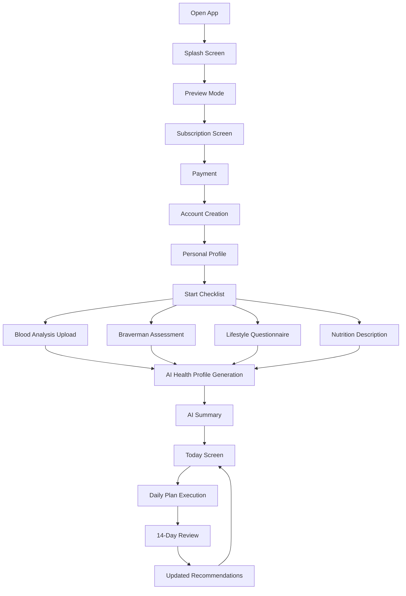

---

# 4. First Launch Flow

## Goal

Give the user a premium first impression and allow them to explore the app without registration.

## Steps

1. User opens Health Coach.
2. Splash screen appears for 2–3 seconds.
3. User is redirected to Preview Mode.
4. User explores demo screens.
5. User can choose to subscribe when ready.

## Flow

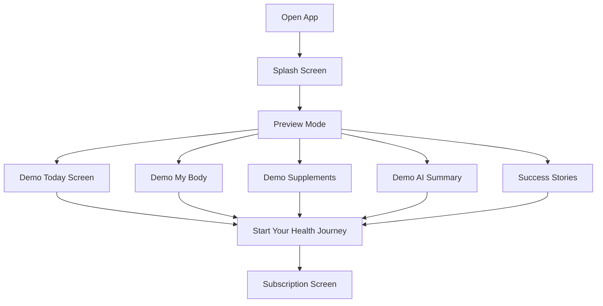

## UX Requirements

Preview Mode must clearly show demo data, not personal data.

Example label:

> Demo Mode

CTA should be visible but not aggressive.

Primary CTA:

- Start Your Health Journey

Secondary CTA:

- View Subscription

---

# 5. Subscription Flow

## Goal

Convert users after they understand the value of the product.

## Trigger Points

Subscription screen can be opened from:

- Preview Mode CTA
- Locked personal recommendation
- Locked AI analysis
- Locked upload flow
- Success stories CTA

## Steps

1. User taps Start Your Health Journey.
2. App opens Subscription Screen.
3. User selects plan:
   - 3,000 RUB per month
   - 15,000 RUB per 6 months
4. User completes payment.
5. App confirms subscription.
6. User is redirected to Account Creation.

## Flow

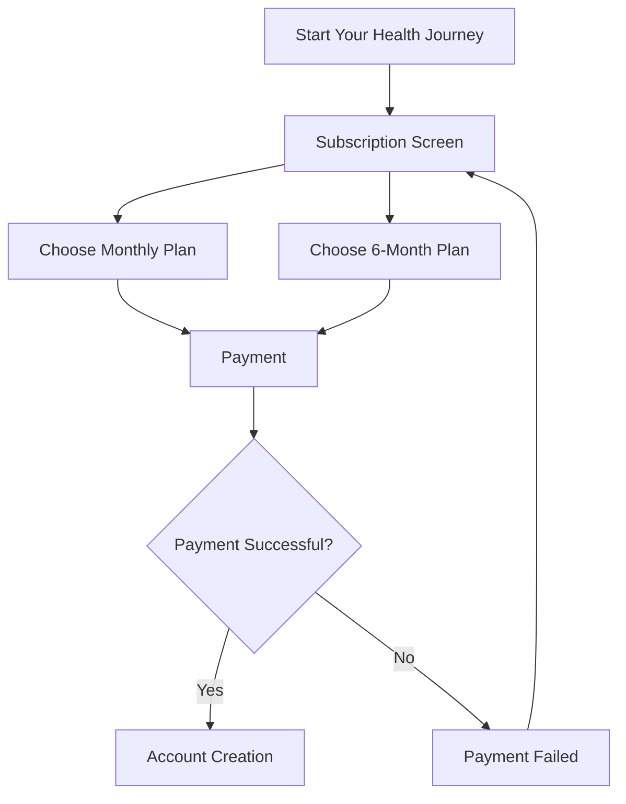

## UX Requirements

The subscription should be positioned as access to:

- Personal AI Health Coach
- Personalized recommendations
- Continuous optimization
- Progress tracking

The app should not say:

> Pay for app access.

The app should say:

> Unlock your personal AI Health Coach.

---

# 6. Account Creation Flow

## Goal

Create a user account only after subscription purchase.

## Required Fields

- Email
- Password

## Optional Future Methods

- Apple ID
- Google login

## Steps

1. Payment succeeds.
2. Account Creation screen opens.
3. User enters email and password.
4. App creates account.
5. User is redirected to Personal Profile.

## Flow

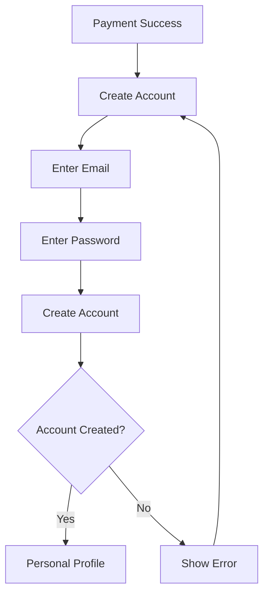

---

# 7. Personal Profile Flow

## Goal

Collect all personal information once and reuse it across the app.

## Data Collected

### Personal Data

- First name
- Last name
- Age
- Gender

### Body Parameters

- Height
- Weight

### Location

- Country
- City
- Address
- Postal code

### Delivery Preferences

- Preferred delivery method
- CDEK pickup point
- Russian Post office
- Delivery comments

### Health Context

- Main goal
- Work type
- Activity level
- Sleep schedule
- Stress level
- Current symptoms

## Flow

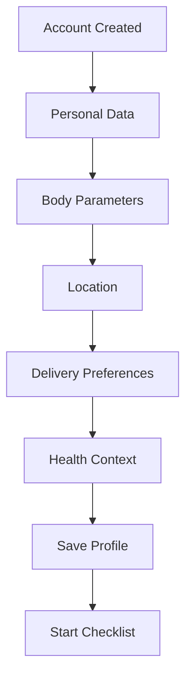

## UX Requirements

The user should understand why the app asks for data.

Example explanation:

> We use this information to personalize your recommendations and avoid asking for the same details again later.

---

# 8. Start Checklist Flow

## Goal

Give the user a clear step-by-step instruction for how to begin.

## Checklist Items

1. Upload blood analysis
2. Complete Braverman assessment
3. Describe lifestyle
4. Describe nutrition
5. Generate AI Health Profile

## Flow

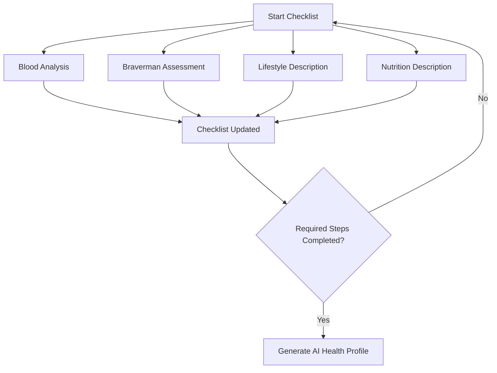

## UX Requirements

Each checklist item should show status:

- Not started
- In progress
- Completed
- Processing
- Failed

The AI Health Profile step should be locked until required steps are completed.

---

# 9. Blood Analysis Flow

## Goal

Allow the user to upload or enter blood test results.

## Entry Points

- Start Checklist
- My Body screen
- Profile
- AI Assistant prompt

## Steps

1. User opens Blood Analysis screen.
2. App asks for gender if not already known.
3. App suggests relevant analysis package.
4. User selects package or uploads existing results.
5. User uploads PDF, image, or manually enters biomarkers.
6. AI extracts biomarkers.
7. User confirms extracted values.
8. App saves biomarkers.
9. App updates checklist.

## Supported Packages

### Male

- Foundation
- Advanced
- Complete

### Female

- Foundation
- Complete

## Flow

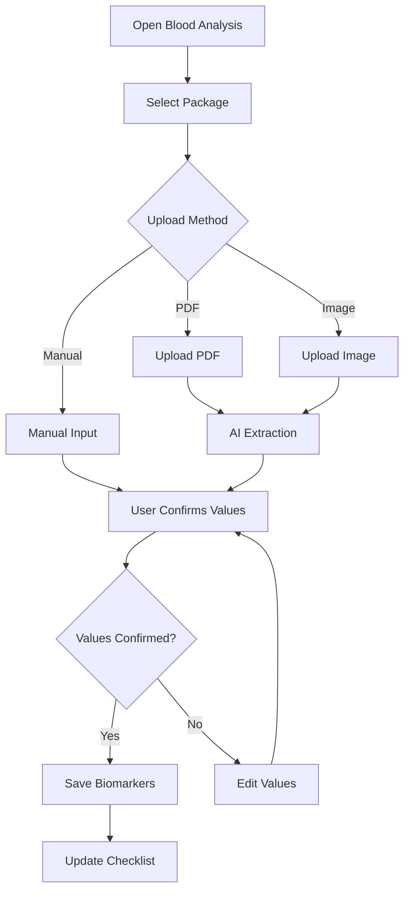

## Edge Cases

### Missing Biomarkers

If important biomarkers are missing, AI should show:

> Your analysis is enough for a partial review, but these markers would improve accuracy.

### Low Quality Upload

If AI cannot read the file:

> We could not extract your results clearly. Please upload a higher-quality file or enter values manually.

### Manual Input

The user can enter biomarkers manually if PDF/image extraction fails.

---

# 10. Blood Test Preparation Flow

## Goal

Help the user prepare correctly before taking blood tests.

## Trigger

When user opens recommended analysis package or plans retesting.

## Content

The app shows preparation guidance:

- Avoid intense training the day before
- Avoid emotional overload
- Avoid overeating
- Sleep well before testing
- Test at the same time of day when tracking progress
- Do not compare results taken under completely different conditions

## Flow

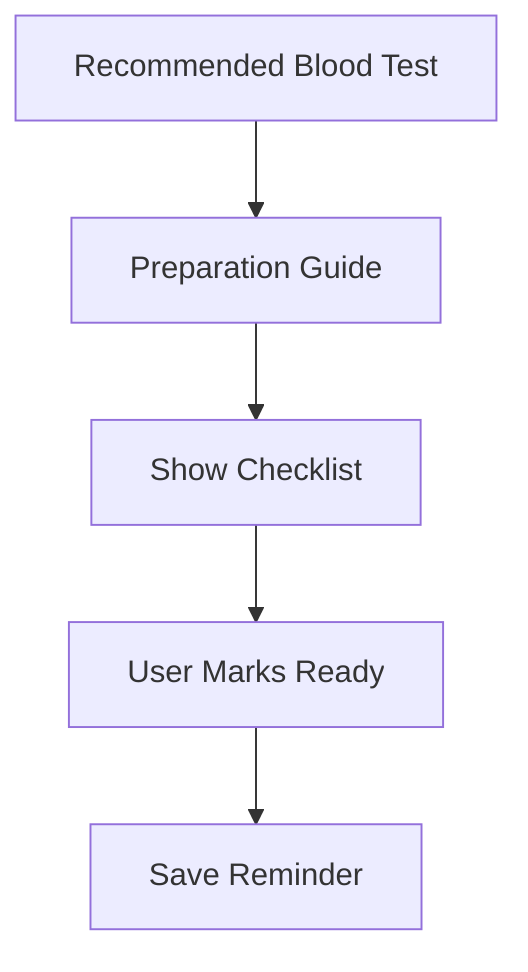

---

# 11. Braverman Assessment Flow

## Goal

Identify neurotransmitter profile and motivation archetype.

## Steps

1. User opens Braverman Assessment.
2. User answers questionnaire.
3. App calculates scores.
4. App identifies dominant neurotransmitter type.
5. App identifies possible deficiencies.
6. App generates Motivation Archetype.
7. Result is saved to user profile.

## Output

Possible dominant profiles:

- Dopamine
- Acetylcholine
- GABA
- Serotonin

Possible archetypes:

- The Strategist
- The Creator
- The Guardian
- The Explorer

## Flow

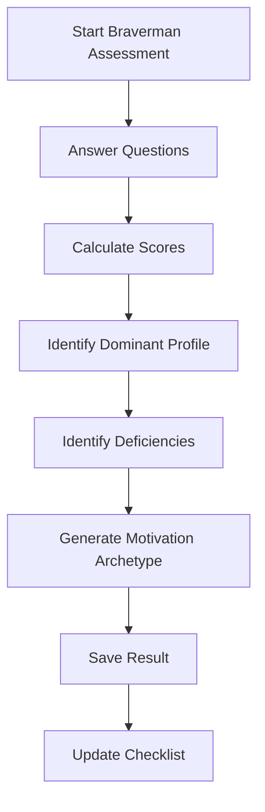

## UX Requirements

The user should receive simple identity-based output rather than raw technical scores.

Example:

> Your Motivation Archetype: The Strategist
>
> You are driven by progress, achievement, and clear goals.

---

# 12. Lifestyle Description Flow

## Goal

Understand the user’s daily life and behavioral context.

## User Provides

- Typical day description
- Work schedule
- Sleep schedule
- Stress level
- Physical activity
- Screen time
- Recovery habits
- Bad habits

## Flow

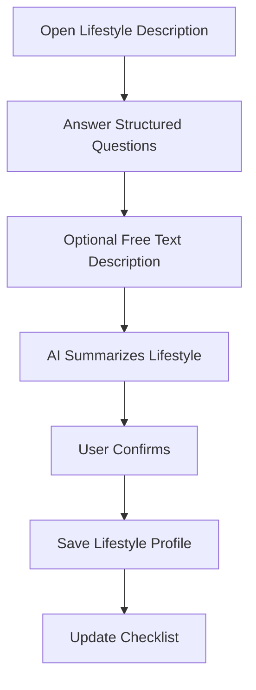

## UX Requirements

The app should allow both:

- Structured questionnaire
- Free text description

This makes the flow easier for users who prefer to describe their day naturally.

---

# 13. Nutrition Description Flow

## Goal

Understand the user’s current eating habits before generating recommendations.

## User Provides

- Typical breakfast
- Typical lunch
- Typical dinner
- Snacks
- Sugar consumption
- Processed food consumption
- Water intake
- Alcohol intake
- Food restrictions
- Food preferences

## Flow

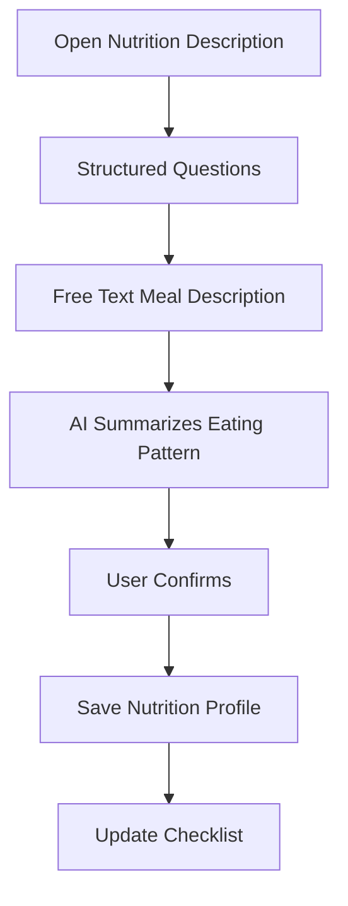

## Nutrition AI Principles

The Nutrition AI should prioritize:

- Foods close to natural state
- Minimally processed foods
- Nutrient density
- Avoiding refined sugar
- Bee products where appropriate
- Personal goals and health status

---

# 14. AI Health Profile Generation Flow

## Goal

Combine all user data into one personalized health profile.

## Input Data

- Personal profile
- Blood analysis
- Braverman assessment
- Lifestyle description
- Nutrition description
- Symptoms
- Goals

## Processing Steps

1. Analyze biomarkers.
2. Calculate biological system scores.
3. Interpret Braverman results.
4. Identify motivation archetype.
5. Review symptoms.
6. Identify limiting factors.
7. Generate AI Summary.
8. Generate supplement recommendations.
9. Generate bee product recommendations.
10. Generate nutrition recommendations.
11. Generate 7-day action plan.

## Flow

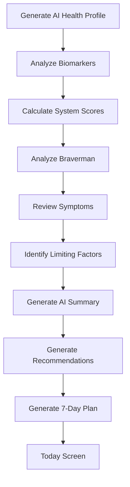

---

# 15. AI Summary Flow

## Goal

Explain to the user why they feel the way they feel and what to do next.

## Sections

1. Current limiting factors
2. What will create the biggest result
3. Expected effect
4. Recommended next step

## Flow

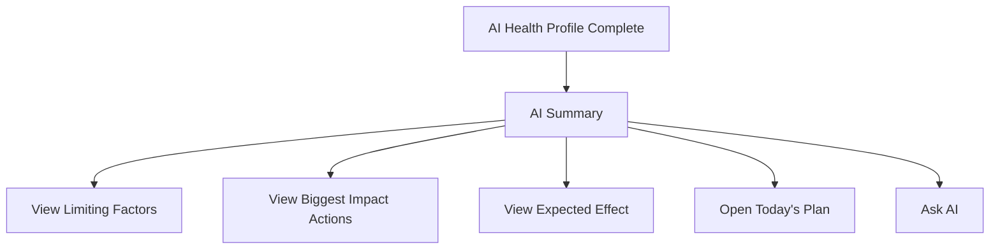

## CTA Options

- View Today’s Plan
- View Supplement Stack
- View My Body
- Ask AI

---

# 16. Today Flow

## Goal

Show the user what to do today.

## Main Elements

- Health Score
- Energy Score
- Motivation Score
- Mood Score
- Today’s tasks
- Supplement schedule
- AI Insight
- Progress bar

## Daily Flow

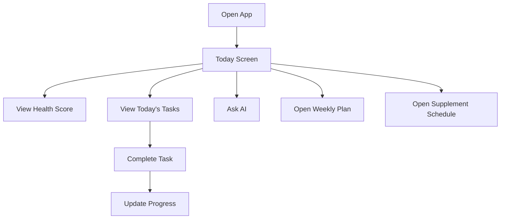

## Task Completion

When the user marks a task complete:

- Progress updates immediately
- Task status is saved
- AI can use adherence data later

---

# 17. Goal Journey Flow

## Goal

Show long-term progress toward the user’s selected goal.

## Example Goals

- Increase energy
- Improve motivation
- Improve emotional state
- Improve sleep
- Increase testosterone
- Improve productivity

## Flow

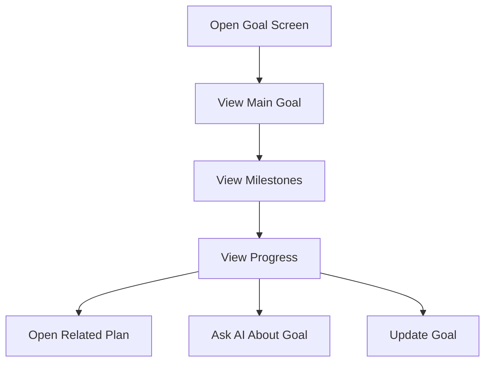

## UX Requirements

The goal screen should connect daily actions with long-term improvement.

Example:

> Your magnesium and sleep protocol are part of your recovery improvement goal.

---

# 18. My Body Flow

## Goal

Show biological systems instead of overwhelming the user with raw biomarkers.

## Systems

- Hormonal System
- Energy System
- Nutritional System
- Stress & Recovery System
- Digestive System
- Sleep System

## Flow

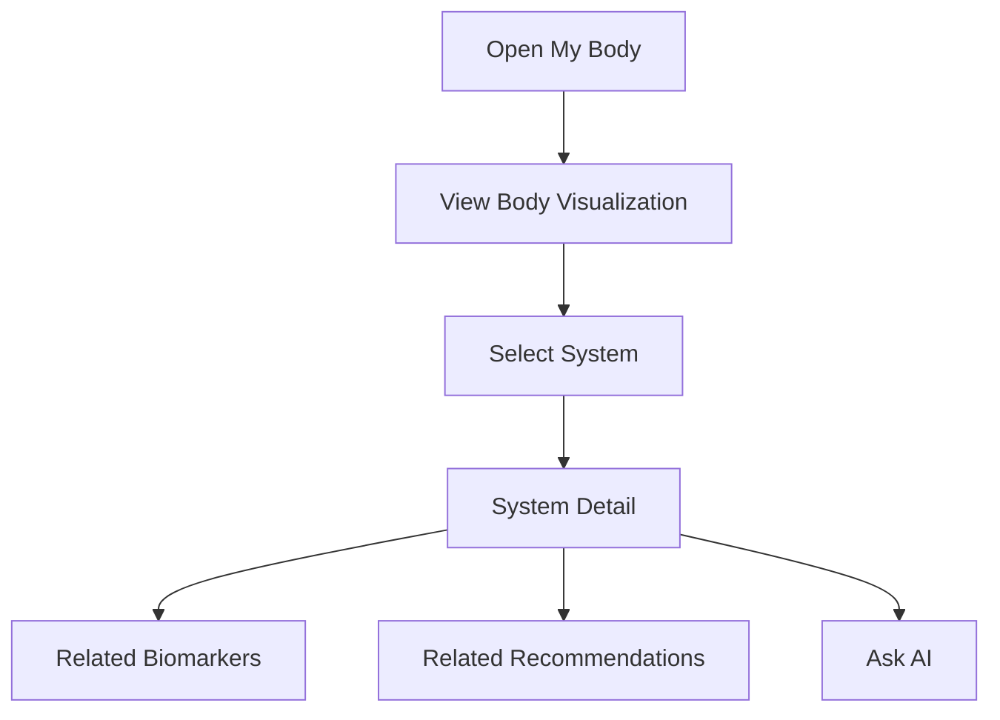

## UX Requirements

Each system should show:

- Status
- Score
- Trend
- Key limiting factor
- Recommended action

---

# 19. Biomarker Detail Flow

## Goal

Explain an individual biomarker in a simple and actionable way.

## Flow

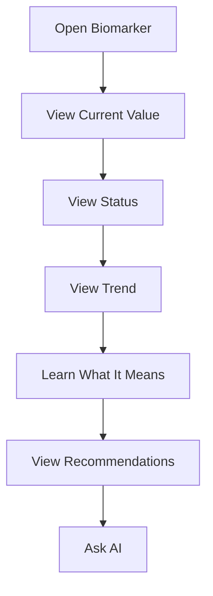

## Biomarker Detail Sections

- Current value
- Reference range
- Trend chart
- What it means
- Why it matters
- What affects it
- How to improve it
- Related recommendations

---

# 20. Supplements Flow

## Goal

Show only relevant supplements and create a clear intake schedule.

## Stack Types

### Essential Stack

Minimum necessary stack.

### Complete Stack

Full optimization stack.

## Flow

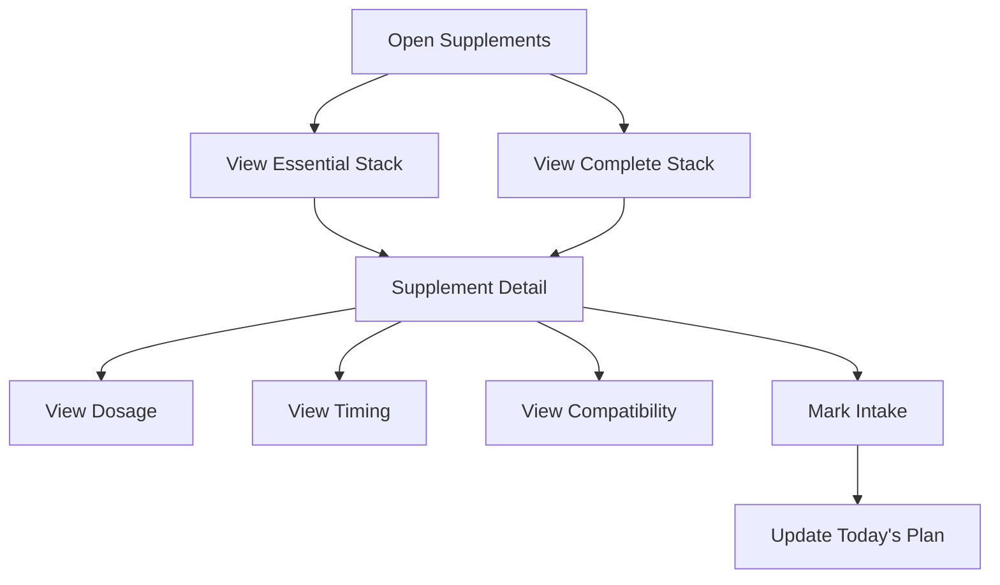

## Supplement Card Includes

- Name
- Dose
- Next intake time
- Status
- Reason
- Details

## Safety Note

Every supplement recommendation should include:

> Before starting any supplement protocol, consult a qualified healthcare professional, especially if you have medical conditions, take medication, are pregnant, breastfeeding, or have allergies.

---

# 21. Bee Products Flow

## Goal

Recommend bee products as supportive natural optimization tools.

## Products

- Perga
- Royal Jelly
- Bee Pollen
- Honey
- Zabrus

## Flow

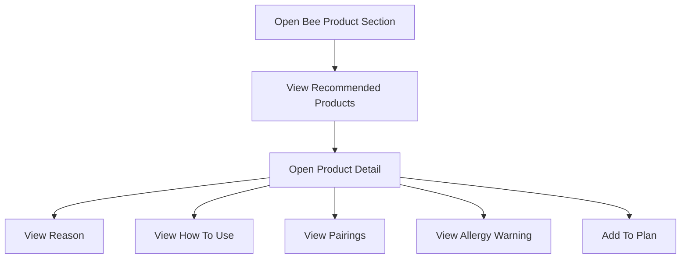

## UX Requirements

Bee products should be positioned as:

> Natural Optimization Tools

not as medical treatments.

---

# 22. Nutrition Flow

## Goal

Provide AI-generated nutrition recommendations and meal adjustments.

## Flow

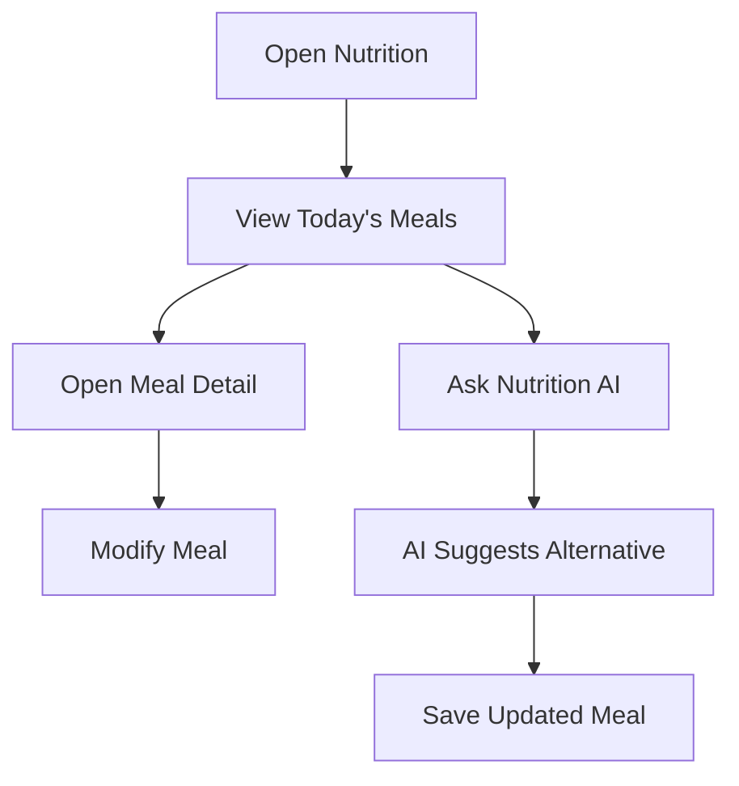

## Example AI Use Case

User asks:

> What should I order at KFC?

AI responds with the best available option based on:

- User goals
- Current nutrition principles
- Sugar restriction
- Protein needs
- Digestive status

---

# 23. AI Assistant Flow

## Goal

Allow user to ask personalized questions.

## AI Context

AI has access to:

- User profile
- Blood analysis
- Braverman profile
- Motivation archetype
- Supplement stack
- Bee product recommendations
- Nutrition profile
- Progress history

## Flow

```mermaid
flowchart TD
    A[Open AI Assistant] --> B[Ask Question]
    B --> C[AI Reads User Context]
    C --> D[AI Generates Answer]
    D --> E{Action Needed?}
    E -->|Yes| F[Update Plan or Recommendation]
    E -->|No| G[Show Answer]
```

## Safety Rule

AI must not diagnose disease.

AI must recommend consultation with a healthcare professional when needed.

---

# 24. Weekly Plan Flow

## Goal

Show 7-day action plan.

## Flow

```mermaid
flowchart TD
    A[Open Weekly Plan] --> B[Select Day]
    B --> C[View Daily Tasks]
    C --> D[Complete Task]
    D --> E[Update Progress]
    E --> F[Update Today Screen]
```

## Daily Task Categories

- Supplements
- Bee products
- Walking
- Training
- Nutrition
- Water
- Sleep
- Recovery practice

---

# 25. 14-Day Review Flow

## Goal

Update recommendations based on subjective progress.

## Trigger

Every 14 days.

## Questions

- How is your energy?
- How is your mood?
- How is your motivation?
- How is your productivity?
- How is your sleep?
- Did anything improve?
- Did anything get worse?
- Did you follow the plan?

## Flow

```mermaid
flowchart TD
    A[14 Days Passed] --> B[Review Notification]
    B --> C[User Answers Questions]
    C --> D[AI Reviews Progress]
    D --> E[Adjust Recommendations]
    E --> F[Update 7-Day Plan]
    F --> G[Update Today Screen]
```

## UX Requirements

The review should feel like a coaching check-in, not a medical form.

---

# 26. Retesting Flow

## Goal

Encourage blood retesting when useful.

## Trigger Examples

- 8–12 weeks after starting supplement protocol
- User reports no improvement
- AI needs updated biomarkers
- Goal requires measurable progress

## Flow

```mermaid
flowchart TD
    A[AI Detects Retest Need] --> B[Show Retest Recommendation]
    B --> C[Show Preparation Guide]
    C --> D[User Uploads New Results]
    D --> E[AI Compares Trends]
    E --> F[Updated Recommendations]
```

---

# 27. Success Stories Flow

## Goal

Build trust and motivation.

## Flow

```mermaid
flowchart TD
    A[Open Success Stories] --> B[Select Category]
    B --> C[View Story]
    C --> D[View Related Goal]
    D --> E[Start Your Health Journey]
```

## Categories

- Energy
- Weight loss
- Sleep
- Muscles
- Productivity
- Emotional state

## Preview Mode

Success Stories should be available in Preview Mode.

---

# 28. Clinic Flow

## MVP Role

Clinic is not a full MVP feature.

It can exist as a placeholder or informational section.

## Future Flow

```mermaid
flowchart TD
    A[Open Clinic] --> B[Choose Clinic]
    B --> C[Select Service]
    C --> D[Choose Date]
    D --> E[Confirm Appointment]
    E --> F[Appointment Saved]
```

## MVP Implementation

The MVP may show:

- Recommended next appointment
- Recommended blood tests
- Future booking placeholder

---

# 29. Profile Flow

## Goal

Allow user to manage personal data and settings.

## Flow

```mermaid
flowchart TD
    A[Open Profile] --> B[Personal Data]
    A --> C[Goals]
    A --> D[Delivery Information]
    A --> E[Subscription]
    A --> F[Notifications]
    A --> G[Settings]
    A --> H[Help]
```

## Editable Data

- Personal information
- Body metrics
- Address
- Delivery point
- Main goal
- Symptoms
- Nutrition preferences
- Notification preferences

---

# 30. Notification Flow

## Goal

Help the user follow recommendations.

## Notification Types

- Supplement reminder
- Water reminder
- Walking reminder
- Sleep reminder
- 14-day review reminder
- Retest reminder
- Incomplete setup reminder

## Flow

```mermaid
flowchart TD
    A[Scheduled Reminder] --> B[Push Notification]
    B --> C[User Opens App]
    C --> D[Relevant Screen]
```

## Tone

Notifications should be supportive, not aggressive.

Example:

> Time for magnesium. This supports recovery and better sleep.

---

# 31. Subscription Expiry Flow

## Goal

Encourage renewal without making the app feel hostile.

## Flow

```mermaid
flowchart TD
    A[Subscription Expired] --> B[Limited Access Mode]
    B --> C[Show Historical Data]
    B --> D[Lock New AI Recommendations]
    D --> E[Renew Subscription CTA]
```

## UX Requirements

Expired users should not lose access to all previous data.

They should lose access to new AI processing and updated plans.

---

# 32. Error and Edge Case Flows

## Failed Payment

User returns to Subscription Screen with error message.

## Failed File Upload

User can retry or enter values manually.

## AI Extraction Error

User can manually correct values.

## Incomplete Profile

App shows missing fields and CTA:

- Complete Profile

## Missing Blood Analysis

AI can generate limited recommendations based on Braverman and symptoms, but should clearly indicate limited accuracy.

## Missing Braverman Assessment

AI can generate biomarker-based recommendations, but motivation personalization remains limited.

---

# 33. MVP Critical Path

The MVP must support this core path:

```mermaid
flowchart TD
    A[Open App] --> B[Preview Mode]
    B --> C[Subscribe]
    C --> D[Create Account]
    D --> E[Fill Profile]
    E --> F[Complete Start Checklist]
    F --> G[Generate AI Health Profile]
    G --> H[Read AI Summary]
    H --> I[Follow Today's Plan]
    I --> J[Complete 14-Day Review]
    J --> K[Receive Updated Plan]
```

If this path works well, the MVP is valid.

---

# 34. UX Success Criteria

The UX is successful if the user can:

1. Understand the value before registration.
2. Subscribe without confusion.
3. Create an account after payment.
4. Complete profile setup.
5. Understand the Start Checklist.
6. Upload blood analysis.
7. Complete Braverman assessment.
8. Receive AI Summary.
9. Understand today’s actions.
10. Return for the 14-day review.

---

# 35. Final Product Rule

Health Coach should always transform complexity into action.

The user should never be left thinking:

> What do I do now?

The app should always provide the next step.

Final rule:

> Every screen should move the user closer to better energy, better emotional state, better motivation, and better productivity.
