# USER_FLOW.md

## Project

Health Coach

## Purpose

This document describes the current user flows for Health Coach.

It follows `CURRENT_SOURCE_OF_TRUTH.md` and the target navigation:

```text
Today / Supplements / Body / AI / Profile
```

## Core Flow Principle

The product should move the user from complexity to action.

The main loop is:

```text
collect data -> generate insight -> show Today plan -> user acts -> user reviews progress -> plan adapts
```

## User Access States

### Guest / Preview User

Can:

- view demo or preview experience;
- understand product value;
- see examples of Today, Body, Supplements, AI, and Profile states;
- open subscription or account flow.

Cannot:

- receive personal AI analysis;
- save personal progress;
- upload personal health data unless product rules allow trial capture;
- receive personal supplement plans.

### Registered User With Incomplete Setup

Can:

- fill profile;
- add goals and preferences;
- complete lifestyle and nutrition inputs;
- upload or enter blood analysis;
- complete Braverman assessment.

Sees:

- setup checklist;
- partial-data states;
- clear next steps.

### Active Personalized User

Can:

- use Today;
- follow weekly plan;
- track supplement routine;
- view Body systems and biomarkers;
- ask AI;
- update symptoms, preferences, and progress;
- complete progress reviews.

### Limited / Expired Access User

May view limited history according to product rules.

New AI generation, updated recommendations, and advanced personalization should require active access when subscription enforcement is enabled.

## Main End-to-End Flow

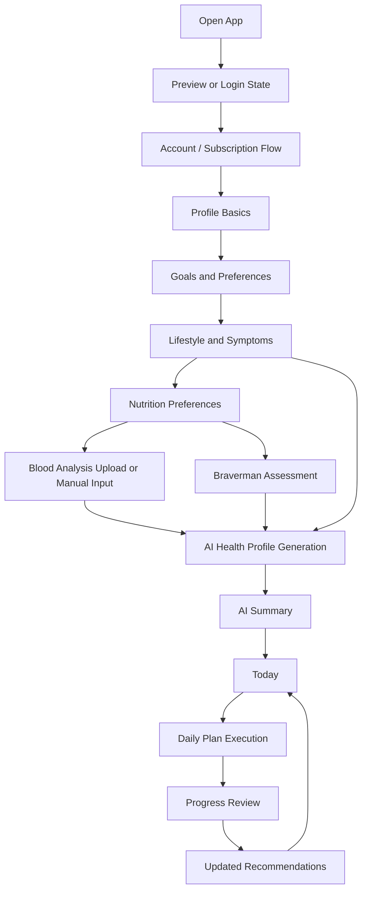

## First Launch / Preview Flow

Goal: show product value before demanding too much effort.

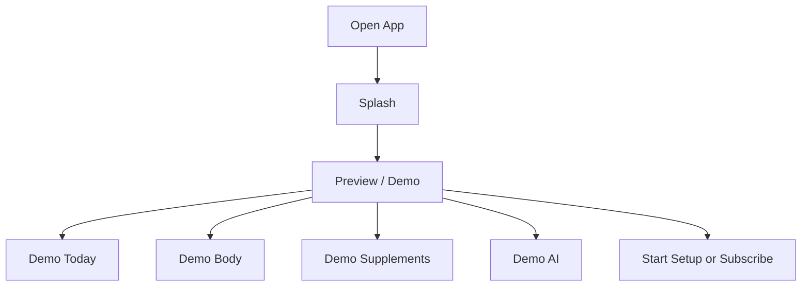

UX rules:

- demo data must be clearly labeled;
- CTA should be visible but not aggressive;
- no personal health claims should be shown before personal data exists.

## Account and Subscription Flow

Business rules may decide whether subscription happens before or after account creation.

The UX must support both implementation orders without changing core product logic.

Recommended abstract flow:

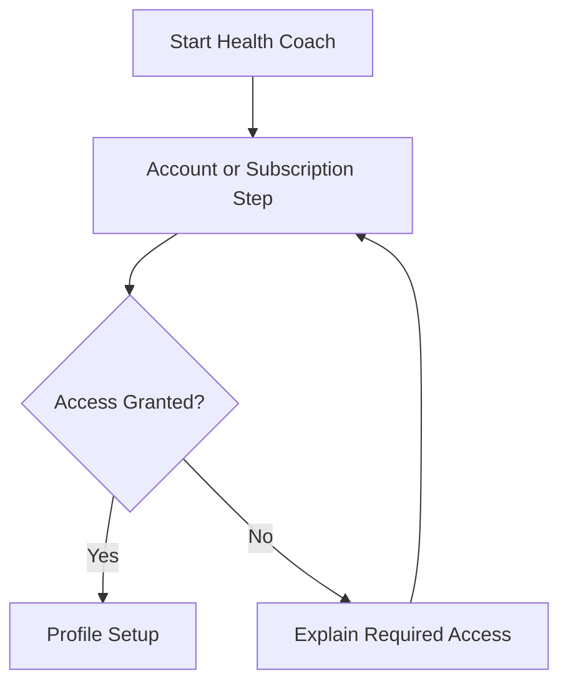

Payment provider details must remain backend-owned.

## Profile Setup Flow

Goal: collect only what is needed for personalization.

Inputs:

- name;
- age or date of birth;
- gender if relevant to analysis packages;
- height;
- weight;
- country/city/timezone if useful for reminders and localization;
- primary goals;
- activity level;
- work type;
- sleep schedule;
- symptoms;
- known allergies;
- medication use flag;
- pregnancy/breastfeeding flag when relevant;
- chronic-condition flag when relevant;
- nutrition preferences and restrictions.

Do not require delivery address in standard profile setup.

## Setup Checklist Flow

Goal: help the user complete the minimum data needed for useful personalization.

Checklist items:

- Profile basics;
- Goals and preferences;
- Lifestyle and symptoms;
- Nutrition preferences;
- Blood analysis upload or manual input;
- Braverman assessment;
- AI Health Profile generation.

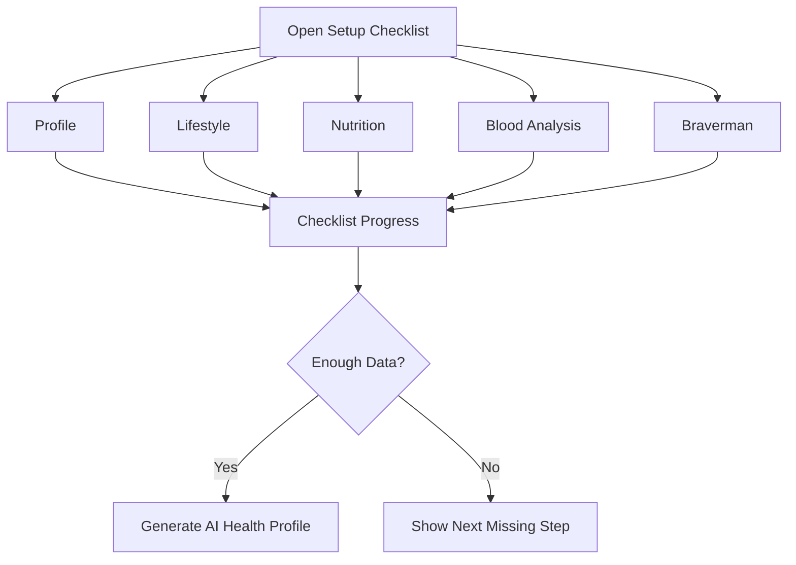

## Blood Analysis Flow

Goal: turn lab data into useful, non-diagnostic insights.

Entry points:

- Body;
- setup checklist;
- AI Summary missing-data CTA;
- AI Assistant suggestion;
- Profile data history.

Flow:

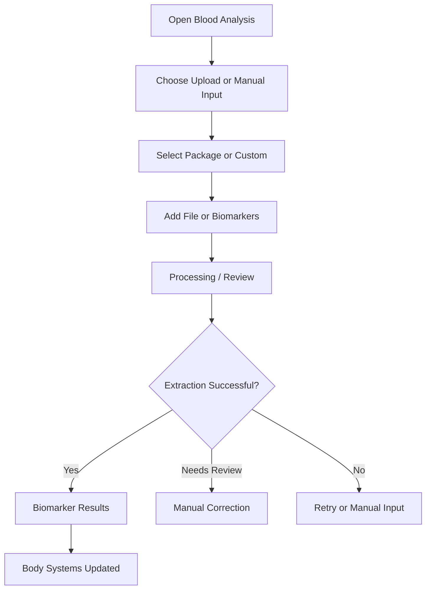

UX rules:

- show file status clearly;
- allow manual correction;
- do not diagnose;
- show confidence and missing markers;
- recommend professional evaluation for potentially serious findings.

## Braverman Assessment Flow

Goal: personalize coaching tone, motivation style, and recommendation framing.

Flow:

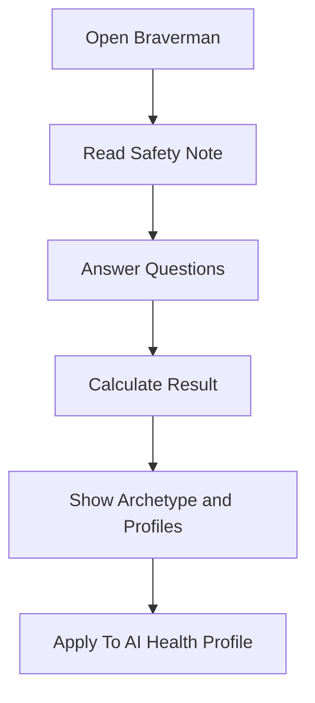

Output:

- dominant profile;
- secondary profile when relevant;
- attention areas;
- motivation archetype;
- coaching style;
- recommendation personalization notes.

The result must not be presented as a neurotransmitter diagnosis.

## Lifestyle and Symptoms Flow

Goal: capture subjective context that lab data may not explain.

Inputs:

- sleep quality and schedule;
- stress level;
- activity level;
- work type;
- fatigue;
- brain fog;
- anxiety/stress;
- mood;
- motivation;
- concentration;
- digestive discomfort;
- recovery;
- free text.

Flow:

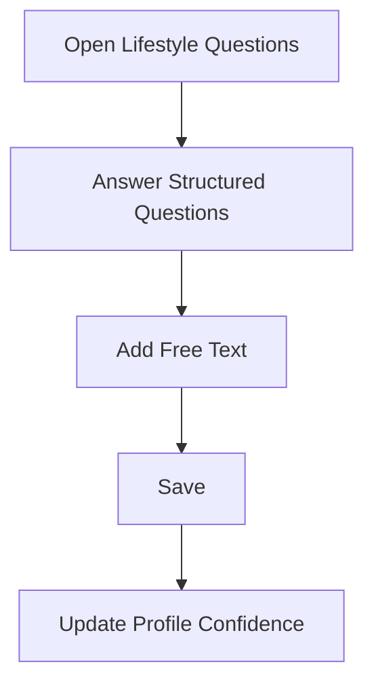

## Nutrition Preferences Flow

Goal: capture food habits, preferences, restrictions, and safety constraints.

Inputs:

- typical day of eating;
- meal timing;
- sugar and processed food intake;
- water intake;
- caffeine and alcohol context if collected;
- allergies;
- intolerances;
- dietary preferences;
- budget or cooking constraints;
- eating-disorder risk flag when appropriate;
- diabetes or high-risk metabolic constraints when appropriate.

Flow:

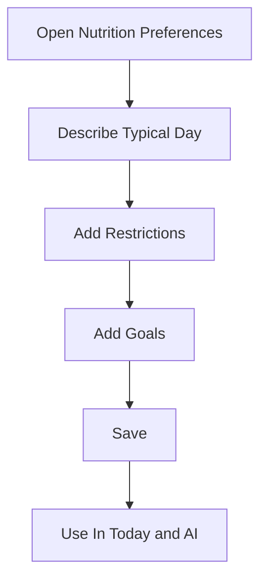

Nutrition guidance must not be framed as medical diet therapy.

## AI Health Profile Generation Flow

Goal: combine available data into an actionable, safety-aware profile.

Inputs:

- profile;
- goals;
- symptoms;
- lifestyle;
- nutrition;
- biomarkers;
- Braverman;
- supplement context;
- progress history.

Flow:

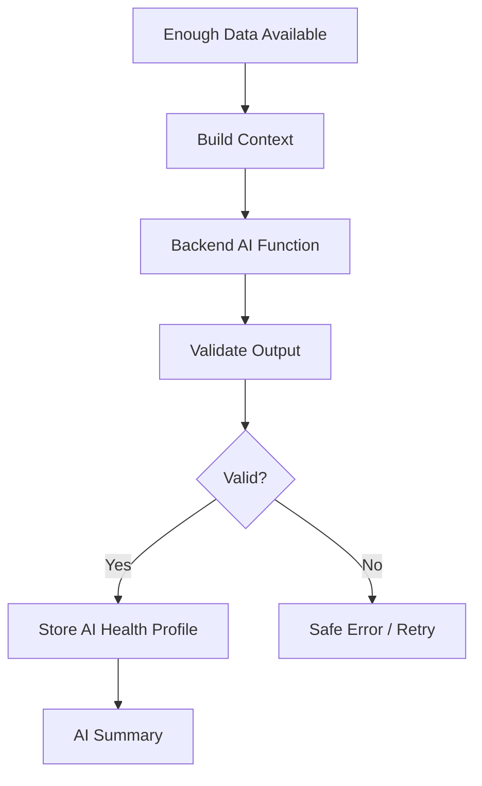

AI output must be validated before rendering.

## AI Summary Flow

Goal: explain the first or updated profile clearly.

Sections:

- current limiting factors;
- highest-impact actions;
- expected effects;
- confidence;
- missing data;
- next best action;
- safety note.

Flow:

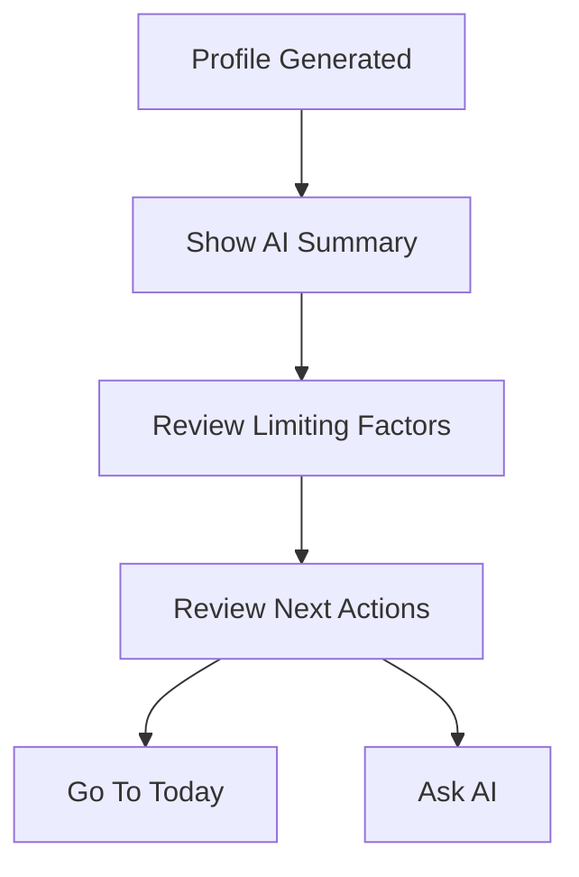

## Today Flow

Goal: give the user a useful plan every day.

Flow:

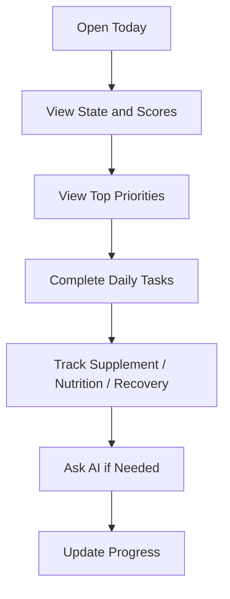

Today should show useful guidance even with partial data, while clearly showing confidence limitations.

## Goal Handling Flow

Goal is not a main tab.

Goals appear inside Today, Weekly Plan, AI, and Profile.

Flow:

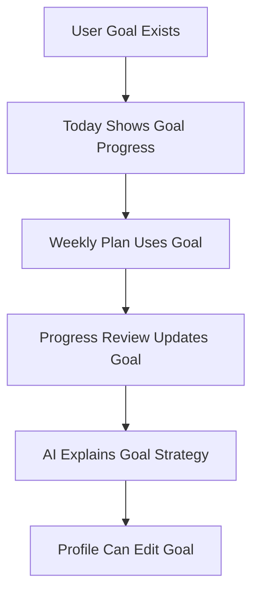

## Body Flow

Goal: help the user understand body systems and biomarkers.

Flow:

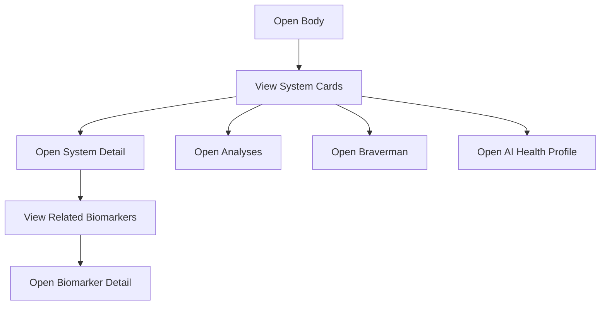

## Supplements Flow

Goal: help the user follow a safe routine.

Flow:

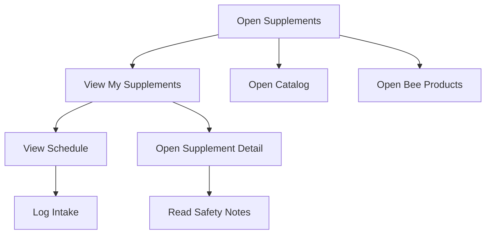

Safety note should be visible before users act on a supplement protocol.

## Bee Products Flow

Bee products are supportive wellness products, not medical treatments.

Flow:

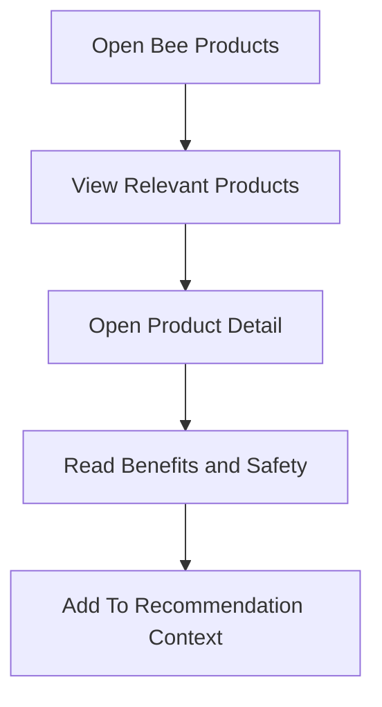

Always consider allergy risk.

## Nutrition Guidance Flow

Goal: help the user choose realistic food actions.

Entry points:

- Today;
- AI;
- Profile preferences;
- Weekly Plan task;
- recommendation detail.

Flow:

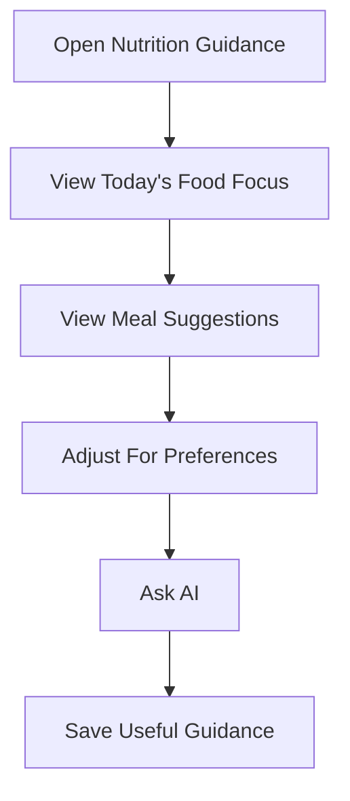

## AI Assistant Flow

Goal: answer user questions with context and safety.

Flow:

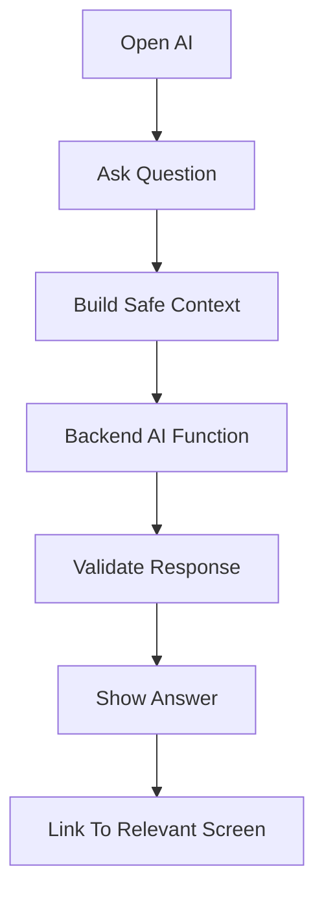

AI must not invent user data. If information is missing, it should say so and suggest the next data step.

## Weekly Plan Flow

Goal: convert recommendations into manageable actions.

Flow:

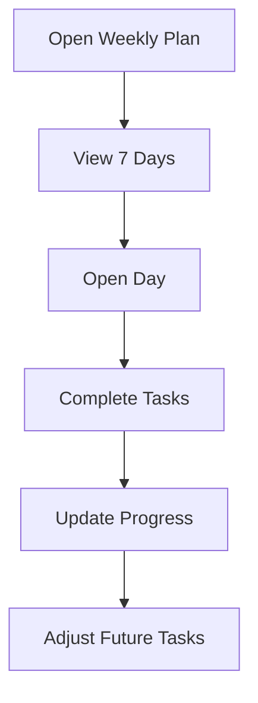

Task categories:

- sleep;
- nutrition;
- supplements;
- activity;
- recovery;
- stress management;
- retesting;
- professional evaluation when appropriate.

## Progress Review Flow

Goal: adapt guidance based on real outcomes.

Trigger examples:

- every 14 days;
- after new blood analysis;
- after low adherence;
- after side effects;
- after major symptom change.

Flow:

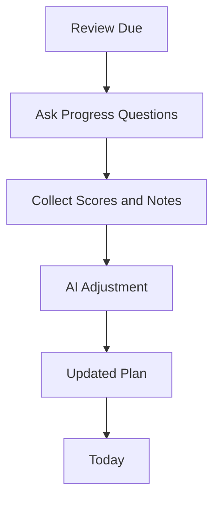

## Profile Flow

Goal: let users control personalization data.

Flow:

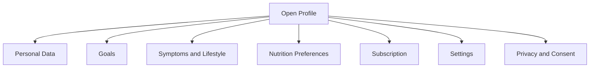

Do not require delivery information unless commerce/delivery is explicitly added.

## Error and Edge Case Flows

### Failed Upload

Show:

- upload failed;
- accepted formats;
- retry;
- manual input.

### AI Error

Show:

- AI could not generate result;
- no diagnosis or unsafe fallback;
- retry;
- support or manual next step.

### Incomplete Data

Show:

- what is missing;
- what can still be used;
- how confidence is affected;
- next best step.

### High-Risk Input

Show safety-aware guidance and recommend qualified professional evaluation when appropriate.

### Subscription / Access Error

Show:

- what access is limited;
- what remains visible;
- how to restore access.

## Product Success Flow

A successful user journey looks like this:

```text
Open app -> understand current state -> complete one useful action today -> track progress -> receive adjusted guidance -> continue safely
```
